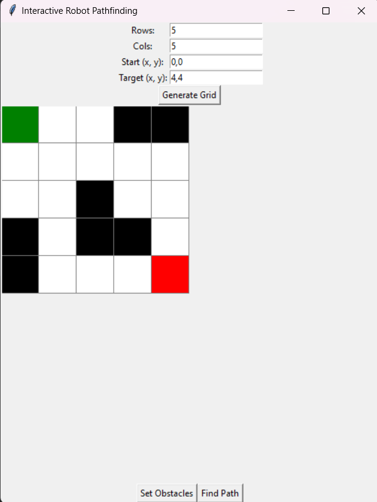
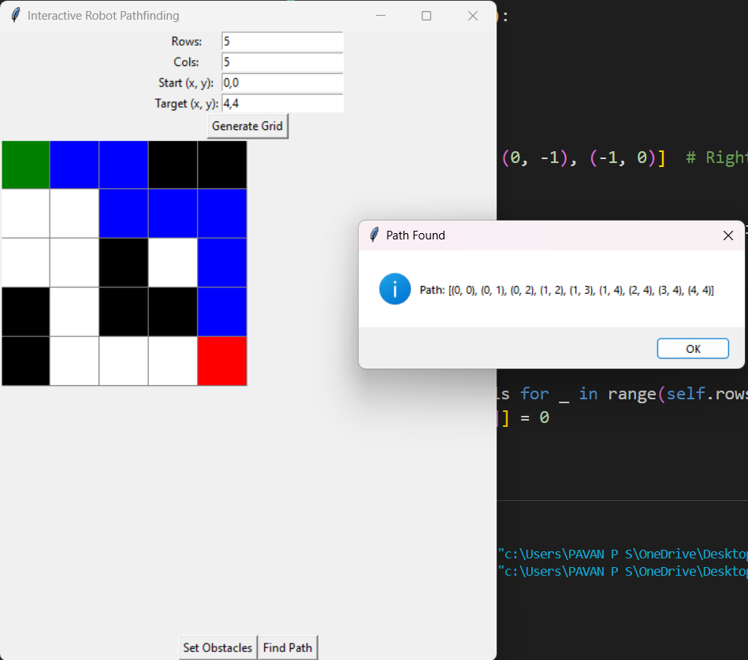

# 🤖 Robot Pathfinding System

An interactive Tkinter-based application that visualizes A* pathfinding for a robot navigating a grid with obstacles.

## 🚀 Features
- **Interactive Grid**: Set custom grid size, start, and target positions.
- **Obstacle Placement**: Click to add/remove obstacles dynamically.
- **A* Pathfinding Algorithm**: Finds the shortest path efficiently.
- **Real-time Visualization**: Animates the robot’s movement step-by-step.

## 🖥️ Demo  
Here’s a preview of the application in action:



## 🎮 How to Use
1. Set **rows**, **columns**, **start**, and **target** positions.
2. Click **Generate Grid** to create the grid.
3. Click **Set Obstacles** and mark obstacles on the grid.
4. Press **Find Path** to visualize the robot’s path.

## 🛠️ Technologies Used
- **Python** 🐍  
- **Tkinter** 🎨  
- **A* Algorithm** 🔍  
 
## 📌 Installation
```bash
git clone https://github.com/yourusername/robot-pathfinding.git
cd robot-pathfinding
pip install -r requirements.txt
python pathfinding.py

